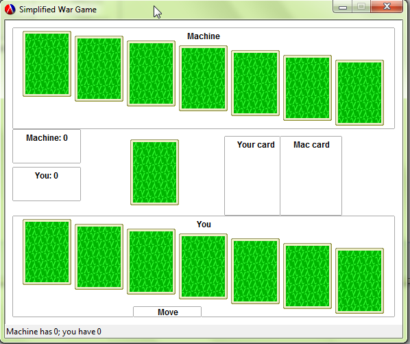

# higher or lower

##Authors
Liuchen Ye

Anand Surisetti

##Overview
This project implements a simplified "war" card game using DrRacket. It is a two player game. One being the computer and the other the player. The game deals 7 random cards to each player. Then each player discards a card from the top of his deck in turn and whoever gets higher card in value scores 2 points. The game keeps track of the score and whoever gets highest score wins the game.

##Screenshot



##Concepts Demonstrated
* **Data abstraction** is used to provide access to the cards library.

* **Lambda** inline functions are used for button click call back procedures.

##External Technology and Libraries
We used games/cards library


##Favorite Lines of Code
####Liuchen Ye
The following code shuffles cards and the optimal number of perfect shuffle is 7:
```
(define deck (shuffle-list (make-deck) 7)
  ))
```
####Anand Surisetti
The simple callback function controls the whole process of looping the operation....
```
(region-callback hit-button)
```

#How to Download and Run
You may want to link to your latest release for easy downloading by people (such as Mark).

Run war_final_code.rkt and click on Move button to start the game. At the end of the game the result will be displayed in the status. To play another game, you will have to close the program and click run again in DrRacket.

