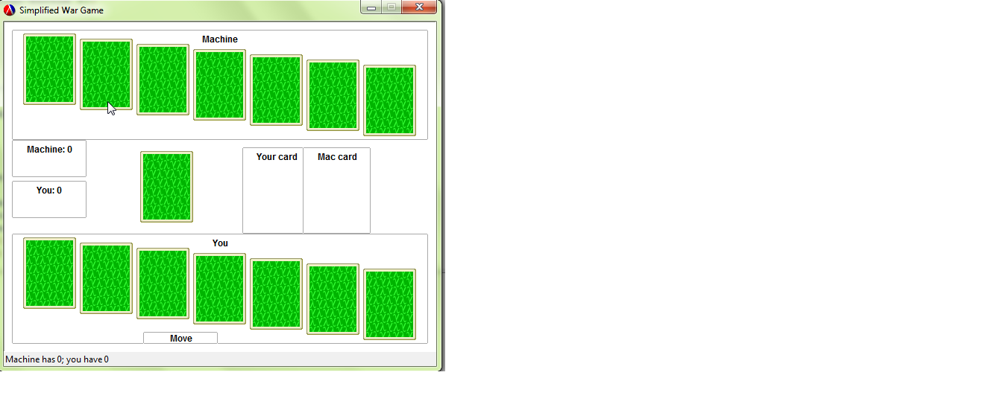

# FP7-higher or lower

##Authors
Liuchen Ye

Anand Surisetti

##Overview
This project implements a simplified "war" card game using DrRacket. It is a two player game. One being the computer and the other the player. The game deals 7 random cards to each player. Then each player discards a card from the top of his deck in turn and whoever gets higher card in value scores 2 points. The game keeps track of the score and whoever gets highest score wins the game.

##Screenshot



##Concepts Demonstrated
Identify the OPL concepts demonstrated in your project. Be brief. A simple list and example is sufficient. 
* **Data abstraction** is used to provide access to the elements of the RSS feed.
* The objects in the OpenGL world are represented with **recursive data structures.**
* **Symbolic language processing techniques** are used in the parser.

##External Technology and Libraries
Briefly describe the existing technology you utilized, and how you used it. Provide a link to that technology(ies).

##Favorite Lines of Code
####Mark (a team member)
Each team member should identify a favorite line of code, expression, or procedure written by them, and explain what it does. Why is it your favorite? What OPL philosophy does it embody?
Remember code looks something like this:
```scheme
(map (lambda (x) (foldr compose functions)) data)
```
####Lillian (another team member)
This expression reads in a regular expression and elegantly matches it against a pre-existing hashmap....
```scheme
(let* ((expr (convert-to-regexp (read-line my-in-port)))
             (matches (flatten
                       (hash-map *words*
                                 (lambda (key value)
                                   (if (regexp-match expr key) key '()))))))
  matches)
```

##Additional Remarks
Anything else you want to say in your report. Can rename or remove this section.

#How to Download and Run
You may want to link to your latest release for easy downloading by people (such as Mark).

Include what file to run, what to do with that file, how to interact with the app when its running, etc. 

