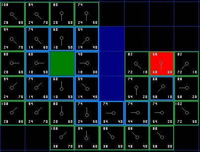

##Authors
Darin Beaudreau

Xiaoyang Li

ChoChak Wong

##Overview
Tune Traveler is the final project for the Spring 2015 Organization of Programming Languages class.
The idea behind the project was to implement the A* path-finding algorithm visually and then, as a
little something extra, give it some sound. We wanted the algorithm to generate a "song" as it traverses
the nodes in the grid by playing a random sound every time it moves from node to node.

##Screenshot
Here are a few "mazes" that have been solved by the algorithm.

**A diagram of how the algorithm steps through the nodes in the grid and chooses the least F score.**



**Maze #1**


**Maze #2**


**Maze #3 (a maze with no solution)**


##Concepts Demonstrated
A* is a slightly fancier version of Djikstra's Algorithm, another path-finding algorithm taught in Discrete Structures. The difference between the two being that A* uses a heuristic search, where Djikstra's lacks this component.

Some of the concepts from OPL that are demonstrated in my project are...

  - Extensive use of maps and lambda procedures were used.
  - Data abstraction was demonstrated with the tile class.

Most of what was used in this project was adapted from other languages to use a functional approach. It was a challenge to think about the A* algorithm, as well as all the other concepts I thought I was familiar with using Racket.

##External Technology and Libraries
The external libraries that were utilized were OpenGL and RSound. OpenGL was used to render the grid and the graphical representation of the maze to the screen, as well as to animate the "player" moving from node to node.

RSound was used to play the random sounds as the player traverses each node.

##Favorite Lines of Code
####Darin

My favorite piece of code was the A* algorithm itself. I felt that it came out looking fairly straightforward. While I think it could have been optimized a bit more through condensing it into separate functions, I didn't find it necessary since none of the code was repeated.

```scheme
; Define the A* search function.
(define (search GRID A B)
  (let ([open nil]        ; The open list, which contains tiles for the algorithm to consider as it walks through the "maze".
        [closed nil]      ; The closed list, which contains tiles that have already been considered (traversed) and can be ignored.
        [current nil]     ; The current tile.
        [neighbors nil])  ; A list containing the neighbors of the current tile.
    (set! open (append open (list A)))                             ; Add the start tile to the open list.
    (define (searchLoop)
      (begin (set! current (lowestF open))                         ; Find the tile in the open list with the lowest F score.
             (set! closed (append closed (list current)))          ; Add the current tile to the closed list since we're done "exploring" it.
             (set! open (remove current open))                     ; Remove the current tile from the open list so we don't accidentally "explore" it again.
             (unless (sameTile? current B)                         ; Unless this is the goal tile, keep searching. Otherwise, we're done here.
               (begin (set! neighbors (getNeighbors GRID current))  ; Retrieve the 8 neighbor tiles surrounding the current tile. Un-walkable tiles excluded.
                      (map (lambda (t)                              ; Map over each neighbor tile...
                             (unless (member t closed)              ; Ignore tiles that are on the closed list... we've already "explored" them.
                               (when (not (member t open))          ; If the neighbor is not in the open list...
                                 (begin (send t setG (compG current t))                   ; Compute the G score of the neighbor.
                                        (send t setH (compH t B))                         ; Compute the H score of the neighbor.
                                        (send t setF (compF (send t getG) (send t getH))) ; Compute the F score of the neighbor.
                                        (send t setParent current)                        ; Set the parent of the neighbor to the current tile.
                                        (set! open (append open (list t)))))))            ; Add the neighbor to the open list.
                           neighbors)
                      (unless (empty? open) (searchLoop))))))       ; If there are no more tiles in the open list, we're done searching.
    (searchLoop)  ; Call the search procedure's main loop.
    (retrace GRID A current)))  ; Retrace the steps from goal to start to find the path that the "player" takes.
```

##Additional Remarks
#### Darin
I had a blast learning about the A* algorithm. Towards the end, I had a lot of trouble getting it to just run, but through perserverance and patience, I was able to implement an algorithm I've been wanting to explore for years.

#How to Download and Run
To download a copy of Tune Traveler, go to the team repository for the project at [oplS15projects/Tune-Traveler](https://github.com/oplS15projects/Tune-Traveler). There are detailed instructions on the page for how to download and run it on your computer.
